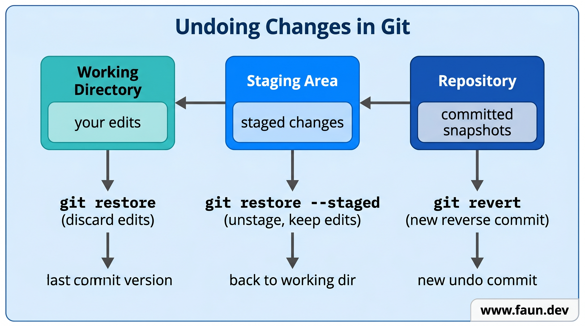
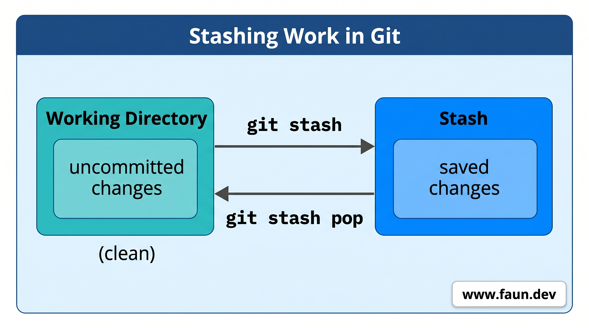

# Oops - How to Undo Anything



```bash
cd ~/my-calculator
```

## Throw Away Changes You Don't Want

```bash
cat << 'EOF' > calculator.py
# calculator.py - A simple calculator

def add(a, b):
    """Add two numbers and return the result."""
    return a + b + 999  # Oops! This is wrong

def subtract(a, b):
    """Subtract b from a and return the result."""
    return a - b

# Try it out
result_add = add(5, 3)
result_sub = subtract(10, 4)
print(f"5 + 3 = {result_add}")
print(f"10 - 4 = {result_sub}")
EOF
```

```bash
git restore calculator.py
```

```bash
python3 calculator.py
```

## Take a File Off the Stage

```bash
cat << 'EOF' > calculator.py
# calculator.py - A simple calculator

def add(a, b):
    """Add two numbers and return the result."""
    return a + b

def subtract(a, b):
    """Subtract b from a and return the result."""
    return a - b

def multiply(a, b):
    """Multiply two numbers and return the result."""
    return a * b

# Try it out
result_add = add(5, 3)
result_sub = subtract(10, 4)
result_mul = multiply(6, 7)
print(f"5 + 3 = {result_add}")
print(f"10 - 4 = {result_sub}")
print(f"6 * 7 = {result_mul}")
EOF
```

```bash
git add calculator.py
```

```bash
git status
```

```bash
Changes to be committed:
  modified: calculator.py
```

```bash
git restore --staged calculator.py
```

```bash
git status
```

```bash
Changes not staged for commit:
  modified: calculator.py
```

```bash
git add calculator.py
git commit -m "Add multiplication function"
```

## Undo a Commit Without Losing History

```bash
git log --oneline
```

```bash
c3d4e5f (HEAD -> main) Add multiplication function
b2c3d4e Add subtraction function
a1b2c3d Add calculator with addition function
```

```bash
git revert HEAD --no-edit
```

```bash
git log --oneline
```

```bash
d4e5f6a (HEAD -> main) Revert "Add multiplication function"
c3d4e5f Add multiplication function
b2c3d4e Add subtraction function
a1b2c3d Add calculator with addition function
```

```bash
python3 calculator.py
```

```
5 + 3 = 8
10 - 4 = 6
```

```bash
git revert HEAD --no-edit
```

```bash
python3 calculator.py
```

```
5 + 3 = 8
10 - 4 = 6
6 * 7 = 42
```

## Put Your Work on Pause



```bash
cat << 'EOF' > calculator.py
# calculator.py - A simple calculator

def add(a, b):
    """Add two numbers and return the result."""
    return a + b

def subtract(a, b):
    """Subtract b from a and return the result."""
    return a - b

def multiply(a, b):
    """Multiply two numbers and return the result."""
    return a * b

def divide(a, b):
    """Divide a by b and return the result."""
    if b == 0:
        return "Error: Cannot divide by zero"
    return a / b

# Try it out
result_add = add(5, 3)
result_sub = subtract(10, 4)
result_mul = multiply(6, 7)
result_div = divide(10, 2)
print(f"5 + 3 = {result_add}")
print(f"10 - 4 = {result_sub}")
print(f"6 * 7 = {result_mul}")
print(f"10 / 2 = {result_div}")
EOF
```

```bash
git stash
```

```bash
git stash pop
```

```bash
git add calculator.py
git commit -m "Add division function with zero-check"
```

## Summary

## What We've Done
