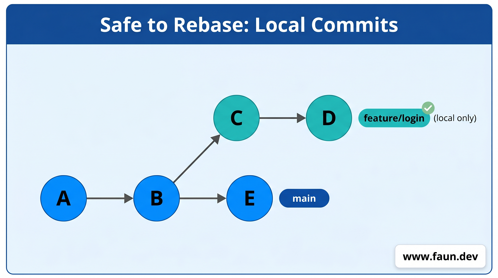
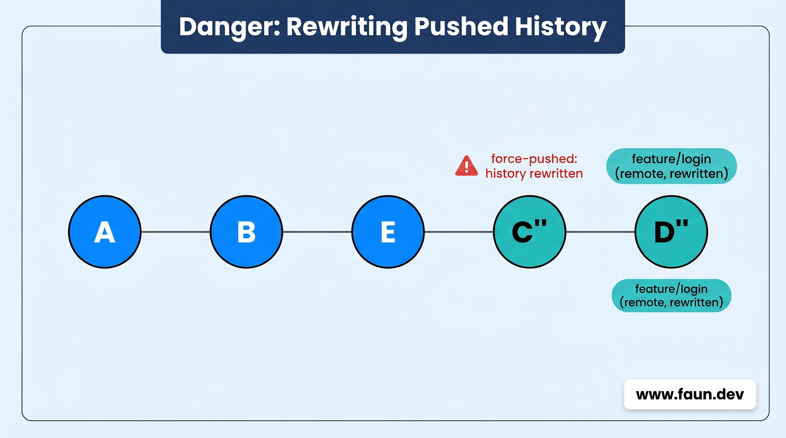
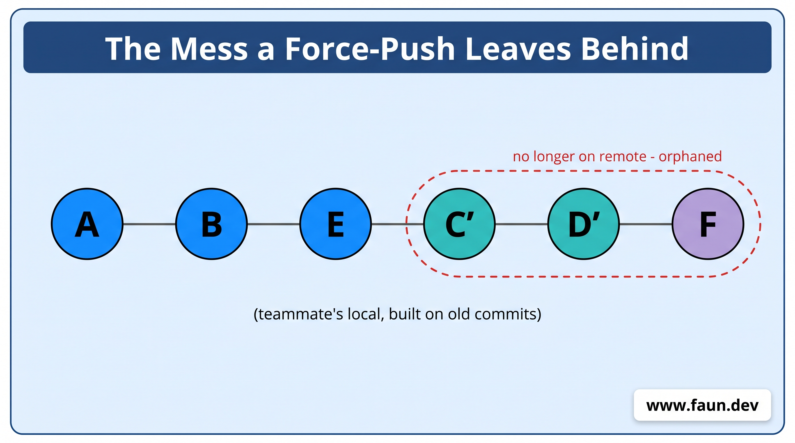

# Keep Your Branch in Sync

```bash
cd ~/my-calculator
```

## Why Your Branch Falls Behind


## Watch It Happen

```bash
git switch main
git pull
```

```bash
git switch -c feature/absolute
```

```bash
cat << 'EOF' > calculator.py
# calculator.py - A simple calculator
# Hosted on GitLab

import math

def add(a, b):
    """Add two numbers and return the result."""
    return a + b

def subtract(a, b):
    """Subtract b from a and return the result."""
    return a - b

def multiply(a, b):
    """Multiply two numbers and return the result."""
    return a * b

def divide(a, b):
    """Divide a by b and return the result."""
    if b == 0:
        return "Error: Cannot divide by zero"
    return a / b

def power(a, b):
    """Raise a to the power of b and return the result."""
    return a ** b

def modulo(a, b):
    """Return the remainder of a divided by b."""
    if b == 0:
        return "Error: Cannot divide by zero"
    return a % b

def square_root(a):
    """Return the square root of a."""
    if a < 0:
        return "Error: Cannot compute square root of negative number"
    return math.sqrt(a)

def floor_divide(a, b):
    """Divide a by b and return the integer part (floor division)."""
    if b == 0:
        return "Error: Cannot divide by zero"
    return a // b

def absolute(a):
    """Return the absolute value of a."""
    return abs(a)

# Try it out
print("--- Calculator Results ---")
print(f"Addition:       5 + 3 = {add(5, 3)}")
print(f"Subtraction:    10 - 4 = {subtract(10, 4)}")
print(f"Multiplication: 6 * 7 = {multiply(6, 7)}")
print(f"Division:       10 / 2 = {divide(10, 2)}")
print(f"Power:          2 ^ 8 = {power(2, 8)}")
print(f"Modulo:         10 % 3 = {modulo(10, 3)}")
print(f"Square Root:    √16 = {square_root(16)}")
print(f"Floor Division: 7 // 2 = {floor_divide(7, 2)}")
print(f"Absolute:       |-5| = {absolute(-5)}")
EOF
```

```bash
git add calculator.py
git commit -m "Add absolute value function"
```

```bash
git switch main
```

```bash
cat << 'EOF' > README.md
# My Calculator

A simple Python calculator built while learning Git.

## Features
- Addition, subtraction, multiplication, division
- Power, modulo, square root, floor division
EOF
```

```bash
git add README.md
git commit -m "Add README file"
```

## Replay Your Work on Top

```bash
git switch feature/absolute
git rebase main
```

```
Successfully rebased and updated refs/heads/feature/absolute.
```

```bash
git log --oneline --graph --all
```

## Merge - Now It's Clean

```bash
git switch main
git merge feature/absolute
git branch -d feature/absolute
```

## Pull Without the Ugly Merge Commits

```bash
git pull --rebase
```

```bash
git config --global pull.rebase true
```

## When Rebase Fights Back

```bash
git add <file>
git rebase --continue
```

```bash
git rebase --abort
```

## The One Rule You Must Follow

### Why it matters

### The safe zone - before pushing



```bash
git rebase main
```


### The danger zone - after pushing


```bash
# rewrites C' and D' into C'' and D''
git rebase main        

# Git rejects this - histories don't match anymore
git push origin feature/login  

# you force it through
git push --force origin feature/login  
```





### The right move - use merge instead

```bash
git merge main
```


### The rule, one more time

## Summary

## What We've Done
