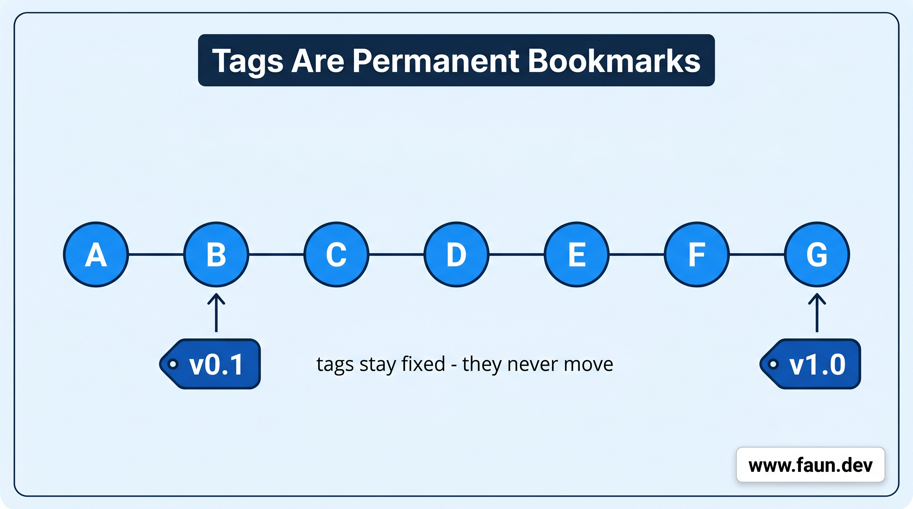

# Mark the Milestones

```bash
cd ~/my-calculator
```

## Tag Your First Release

```bash
git tag v1.0
```

```bash
git tag
```

```bash
v1.0
```



## Two Kinds of Tags

```bash
git tag -a v1.0 -m \
  "First stable release with nine calculator operations"
```

```bash
git tag -d v1.0
git tag -a v1.0 -m \
  "First stable release with nine calculator operations"
```

```bash
git show v1.0
```

## List and Inspect Tags

```bash
git tag
```

```bash
git tag -l "v1.*"
git tag -l "v1.0*"
git tag -l "v2.*"
# ... and so on
```

## Tag a Commit After the Fact

```bash
git log --oneline
```

```bash
git tag -a v0.1 <commit-hash> \
  -m "Early version with only add and subtract"
```

```bash
git tag
```

```
v0.1
v1.0
```

## Share Your Tags with the Team

```bash
git push origin v1.0
```

```bash
git push origin --tags
```

## Travel Back to a Tag

```bash
git checkout v0.1
```

```bash
git switch main
```

```bash
git checkout v0.1
git switch -c fix/old-version-bug
```

## Remove a Tag You Don't Need

```bash
git tag -d v0.1
```

```bash
git push origin --delete v0.1
```

## How to Name Your Tags

## Tags vs. Releases - What's the Difference?

## Summary

## What We've Done
