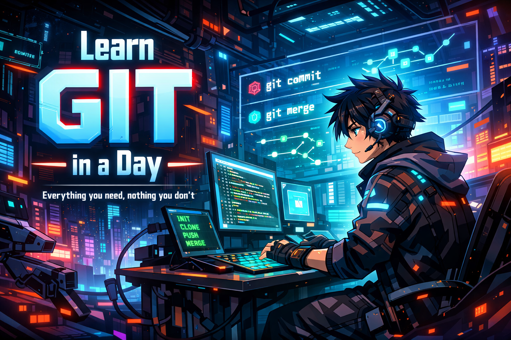

# Learn Git in a Day

This is the full source code for the practical guide *[Learn Git in a Day: Everything you need, nothing you don't](https://faun.dev/sensei/academy/learn-git-in-a-day-fae561-02e121-dfadb8-e2e0a6-4bc/)*

---

*Learn Git in a Day: Everything you need, nothing you don't* is a comprehensive, practical guide that takes you from zero Git knowledge to confidently using it in a real workflow - in a single day.

Git is the most widely used version control system in the world. It's used by solo developers working on side projects, by teams of hundreds shipping production code, and by virtually every serious software company on the planet. If you want to work in tech - or already do - Git is not optional. It's the baseline.

And yet, most people learn it the wrong way. They pick up a handful of commands by copying and pasting from Stack Overflow or ChatGPT, never really understanding what's happening underneath. They get by until something goes wrong - a merge conflict, a detached HEAD, a history that looks nothing like it should - and then they panic, because they never built a real mental model of how Git works.

This guide is different. It's not a command reference. It's not a list of recipes to memorize. It's a structured walkthrough that builds your understanding from the ground up - starting with why Git exists, how it thinks about your files and history, and then moving into the workflows you'll actually use every day.

By the end, you won't just know the commands. You'll understand what they do, why they work the way they do, and how to think your way through situations you've never seen before.

It's written for people who have heard of Git, maybe even felt intimidated by it, but never sat down and properly learned it. Students, self-taught programmers, career switchers - anyone who wants to stop avoiding Git and start using it like they know what they're doing.

No prior experience with Git or version control is assumed. You don't need to know what a commit is, what a branch does, or why any of it matters yet. All of that will make sense by the end.

The only things you need: basic comfort with a terminal and a rough idea of what files and folders are. If you've ever written a small script in any language, you're ready to start.

## What You'll Learn

Throughout this guide, you'll build a small Python calculator app. The app itself is intentionally simple - it's not the point. Git is the point. The calculator just gives us real files to track, real commits to make, and real conflicts to resolve. Each chapter adds new features to the calculator while introducing new Git concepts, so the project grows alongside your skills.

By the end of this guide, you'll be able to do all of the required Git tasks that you'll encounter in a real software job, including these:

- Explain what version control is and why every software team relies on it

- Set up Git on your machine with your name, email, and preferred settings

- Turn any folder into a tracked project and start recording its history

- Understand the three places your files live in Git - your working directory, the staging area, and the repository - and move changes between them with confidence

- Choose exactly which changes to include in a snapshot and which to leave out

- Browse your project's full history and inspect any past version in detail

- Throw away edits you don't want before they're saved

- Pull a file back out of the staging area without losing your changes

- Reverse a change that's already been saved, without rewriting history

- Set aside unfinished work, switch to something else, and come back to it later

- Work on multiple features or fixes at the same time using branches, without them interfering with each other

- Combine work from different branches into one

- Resolve situations where two people changed the same lines in the same file

- Connect your local project to a server so your code is backed up and accessible from anywhere

- Authenticate securely with a remote server without typing passwords

- Upload your latest work so teammates can see it

- Download and incorporate changes others have made

- Understand the difference between just downloading what's new and actually applying it to your files

- Get a full copy of someone else's project, with its entire history, onto your machine

- Propose changes for review before they're merged, the way professional teams do it

- Follow the standard daily workflow: branch off, make changes, share your branch, get feedback, merge

- Write clear descriptions of what you changed and why, so reviewers and your future self can follow along

- Reorganize your branch's history on top of the latest shared work for a cleaner, linear timeline

- Know when reorganizing history is safe and when it would break things for your teammates

- Keep your branch current with what everyone else has done, without creating unnecessary merge clutter

- Prevent generated files, secrets, and editor junk from ever entering your repository

- Write ignore rules using wildcards, folder patterns, and exceptions

- Stop tracking a file that was committed by mistake, without deleting it from your computer

- Mark important milestones in your project - like releases - so you can find and revisit them instantly

- Understand the difference between a quick git bookmark and a fully documented version marker

- Share your version markers with the rest of the team on the server

- Create shortcuts for the commands you type most often

- Trace any line of code back to the person and commit that last changed it

- Fix a typo or include a forgotten file in your most recent snapshot without creating a new one

- Keep your list of branches clean by removing the ones that have already been merged

All of these are things you'll do on a daily basis as a developer, DevOps specialist, data scientist, or any role that involves working with code. By mastering them, you'll be able to integrate into any team, contribute to any project, and handle the situations everyone encounters at some point.

## About the Author

[Aymen El Amri](https://aymenelamri.com/) is a software and cloud-native engineer, trainer, author, and technopreneur with 15+ years of experience in building and scaling distributed systems, cloud architectures, and modern software.

He founded [FAUN.dev()](https://faun.dev/), one of the web's most active software engineering communities focused on SWE, cloud-native engineering, modern software delivery, AI/ML, and other related topics.

He's trained thousands of engineers on Python, AI, DevOps, SRE, Kubernetes, microservices, and cloud architectures, helping teams build reliable and scalable systems. His technical guides and courses are widely used by engineers and organizations looking to adopt modern software practices.

His work earned several honors, including a national open-source award. He also advises companies on shaping their cloud-native and platform engineering direction. TechBeacon listed him among the top 100 DevOps professionals to follow.

Find him on [FAUN.dev()](https://faun.dev/@eon01), [LinkedIn](https://www.linkedin.com/in/elamriaymen/), or [X](https://x.com/eon01).

## Join the Community

This guide was published by FAUN.dev(), a community of developers and engineers who are passionate about learning and sharing their knowledge. If you're interested in joining us, you can start by subscribing to our newsletter at [faun.dev/join](https://faun.dev/join). Every week, we share the most important and relevant articles, tutorials, and videos on the latest technologies and trends, including cloud-native, DevOps, automation, and more.

You can also follow us on X at [@joinFAUN](https://x.com/joinFAUN) and on [LinkedIn](https://www.linkedin.com/company/22322295) to stay up to date with the latest news and announcements.
